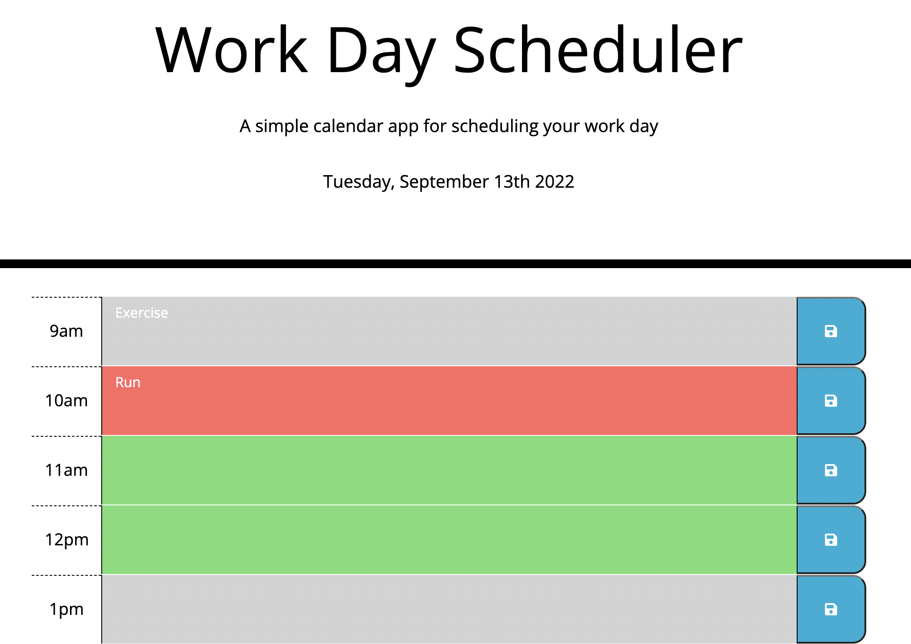

# Work-Day-Scheduler

## Project Description
Work Day Scheduler is a simple calendar application that allows a user to save important events for each hour of the day. In this daily planner each time block is color-coded to indicate whether it is in the past, present, or future. By clicking into a time block, user can enter an event and save that event for that time block. The input is saved in local Storage.

## Technologies Used
* Third Party APIs (jQuery, jQuery Moment, Bootstarp)
* HTML5
* CSS3
* JavaScript

## Mockup

## Link to deployed website
https://sanam1060.github.io/work-day-scheduler/